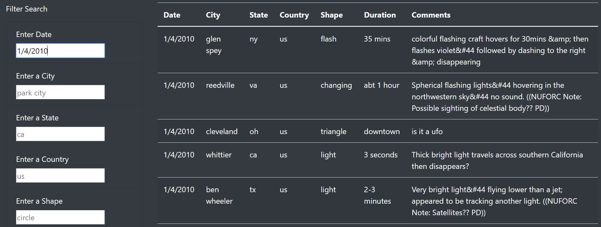
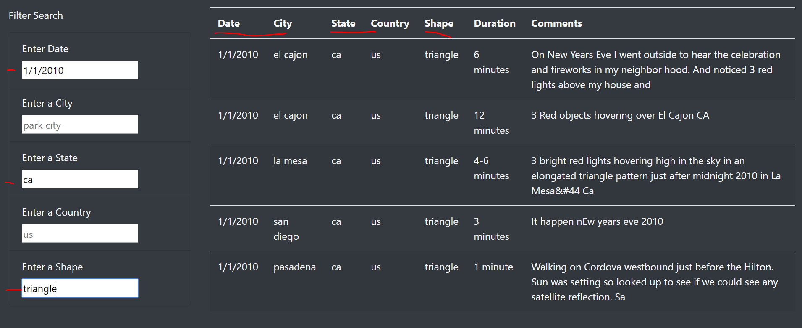

# UFOs

## Overview of the analysis
The purpose of this project is to allow user filter multiple criteria to search for UFO sightings. For instance, users may add table filters for the date, city, state, country, and shape for their search.

## Results
To perform a search, simply enter a any value that matches the criteria, for example, enter a date in the "Enter Date" input box. Once entered, the data table will show every UFO sightings that occurred on the given date.

The figure below shows the result of the table when "1/4/2010" was entered into the "Enter Date" input box:

If the user wants to search for UFO sightings with multiple criteria, simply enter the information into the correct input boxes and the table will filter the data for the user.

For instance, the figure below shows the result when the user input "1/1/2010" into "Enter a Date", "ca" into "Enter a State", and "triangle" into "Enter a Shape".

## Analysis
A drawback of this webpage is that the user has to input the exact date format as the dataset's date format. Although the placeholder already demonstrates the appropriate date format, some users may just input data in their preferred format, thus not giving the appropriate results.

A recommendation for further development is to solve the drawback mentioned above. Regular expression may be used such that users may enter date in their preferred format and generate the correct results.

Another recommendation is to inform users that they may have input the wrong value or data type, or when the dataset does not contain those values. For instance, when the table is not showing any result, it could be that there is a typo, the input format is incorrect, the data type is incorrect, or there simply isn't data that matches the values given. It would be clearer in informing users whether any of the above occurred when no results are shown.